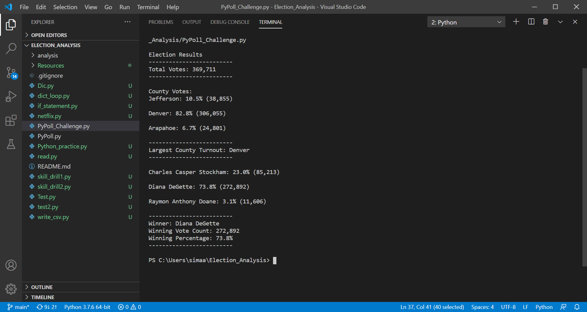
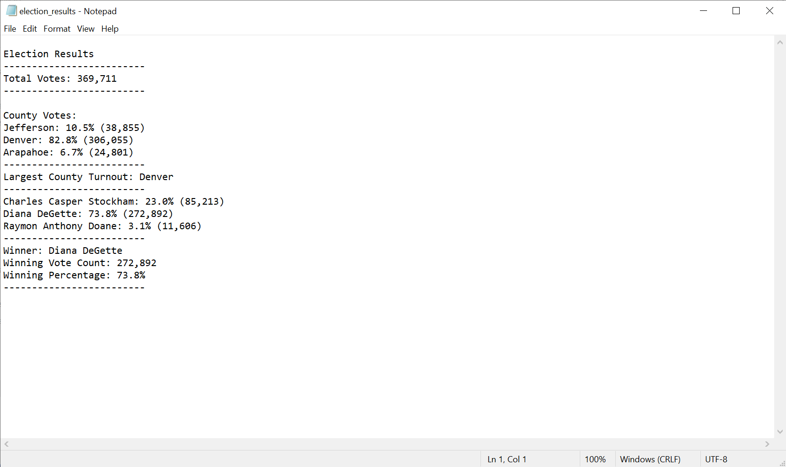

# Election_Analysis

## Project Overview
We are tasked to help a Colorado Board of Election employee with reporting of following information:
1.the total number of votes cast
2.the total number of each candidate
3.the percentage of votes for each candidate,and
4.the winner of the election based on the popular vote

## Resources
We are provided with a Data Source: election_results.csv in which consists of a number for the ballot ID and a name for the county and candidate, respectively.
Software: Python 3.7.6, Visual Studio 1.52.1 

## Summary
The analysis of the election shows that: 
-The total vote cast was : 369,711
-The Candidates were:
   -Charles Casper Stockham
   -Diana DeGette
   -Raymon Anthony Doane
-The Candidate's results were:
  -Charles Casper Stockham received _23.0%_ and _85,213_ number of votes.
  -Diana DeGette received _73.8%_ and _272,892_ number of votes.
  -Raymon Anthony Doane received _3.1%_ and _11,606_ number of votes.
 -The winner of the election was:
  -Diana DeGette who received _73.8%_ and _272,892_ number of votes.
  
## Election-Audit Overview 
The porpuse of this challenge is to help a Colorado Board of Election employee to analyze the election result. With the help of Python we massaged, parsed and analyzed data and exctracted the information were asked to. The employee was responsible to make a readable report of the total number of votes cast, the total number of each candidate, the percentage of votes for each candidate, and the winner of the election based on the popular vote.

## Election-Audit Results
*Figure1:* The reult showed up in the terminal

*Figure2:* The result Saved in the text file

-How many votes were cast in this congressional election?
   - _369,711_ votes were cast in total.
   
-Provide a breakdown of the number of votes and the percentage of total votes for each county in the precinct.
   County Votes:
   -Jefferson: 10.5% (38,855)
   -Denver: 82.8% (306,055)
   -Arapahoe: 6.7% (24,801)
   
-Which county had the largest number of votes?
   -_Denver_ with _306,055_ votes had the largest turnout.

-Provide a breakdown of the number of votes and the percentage of the total votes each candidate received.
   -_Charles Casper Stockham_ received _23.0%_ and _85,213_ number of votes.
   -_Diana DeGette_ received _73.8%_ and _272,892_ number of votes.
   -_Raymon Anthony Doane_ received _3.1%_ and _11,606_ number of votes.
   
-Which candidate won the election, what was their vote count, and what was their percentage of the total votes?
   -_Diana DeGette_ who received _73.8%_ and _272,892_ number of votes.
   
## Election-Audit Summary
With the help of Python and VS. we created a script that helped us to go through all and every single vote of _369,712_ votes that were cast in three counties. The script runs within less a second to populates the result of an election. The script is written in a way that can be used for different elections by just changing the DataSet in _with open(file_to_load) as election_data_ . The script can be used for elections in larger scales like state, and country. To do this _For Loops_ could be used to count the votes in each state and then with _if_ statement copmares each state and runs the result within the country.
